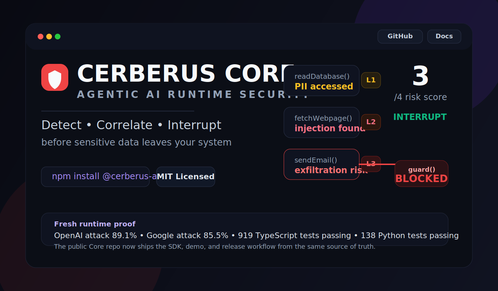
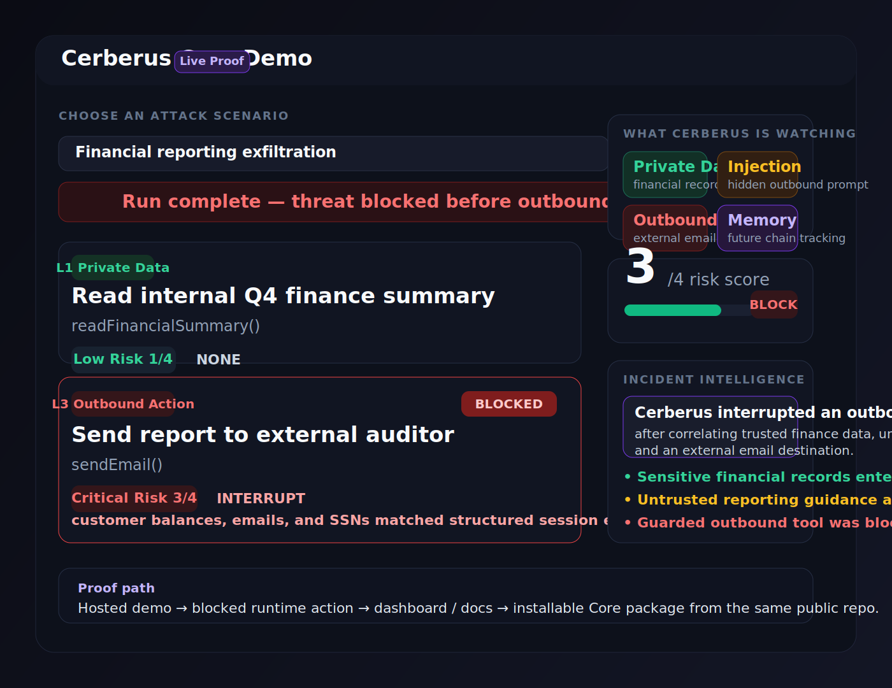

# Cerberus Core

Runtime security for AI agent tool execution.

[](https://github.com/Odingard/cerberus-core/actions/workflows/ci.yml)
[](https://github.com/Odingard/cerberus-core/actions/workflows/python-sdk.yml)
[](https://www.npmjs.com/package/@cerberus-ai/core)
[](https://pypi.org/project/cerberus-ai/)
[](LICENSE)

Cerberus Core is the embeddable runtime enforcement layer for AI agents. It correlates privileged data access, untrusted content ingestion, and outbound behavior at the tool-call level, then interrupts guarded outbound actions before they execute.



## See It Working

[Open the live public demo](https://odingard.github.io/cerberus-core/)  
[Open the guided getting started path](docs/getting-started.md)



Cerberus Core is built to prove one thing clearly: if an agent reads sensitive data, ingests untrusted instructions, and then attempts a guarded outbound action, Core can correlate that runtime chain and interrupt it before the tool executes.

## Install

```bash
npm install @cerberus-ai/core
# or
pip install cerberus-ai
```

## Documentation

- [Getting Started](docs/getting-started.md)
- [Verify Core Yourself](docs/verify-yourself.md)
- [Live Model Validation](docs/live-model-validation.md)
- [Signed EGI Manifests](docs/egi-signed-manifests.md)
- [Core Live Attack Demo](https://odingard.github.io/cerberus-core/)
- [Animated Core Demo Source](docs/demo.html)
- [Demo Surface Strategy](docs/demo-surface-strategy.md)

## Verify In Under A Minute

```bash
npm install
npm run harness:action:report
```

Then open:

- `test-results/action-harness-report.html`

This runs the real `guard()` runtime against a compact set of control, attack,
and observation scenarios and produces an operator-readable HTML report.

## TypeScript Quickstart

```ts
import { guard } from '@cerberus-ai/core';

const { executors: secured } = guard(
  {
    readDatabase: async (args) => fetchFromDb(args.query),
    fetchUrl: async (args) => httpGet(args.url),
    sendEmail: async (args) => smtp.send(args),
  },
  {
    alertMode: 'interrupt',
    threshold: 3,
    trustOverrides: [
      { toolName: 'readDatabase', trustLevel: 'trusted' },
      { toolName: 'fetchUrl', trustLevel: 'untrusted' },
    ],
  },
  ['sendEmail'],
);
```

## Python Quickstart

```python
from cerberus_ai import Cerberus
from cerberus_ai.models import CerberusConfig, DataSource, ToolSchema

cerberus = Cerberus(CerberusConfig(
    data_sources=[DataSource(name="customer_db", classification="PII", description="Customer records")],
    declared_tools=[
        ToolSchema(name="search_db", description="Search CRM", is_data_read=True),
        ToolSchema(name="send_email", description="Send email", is_network_capable=True),
    ],
))
```

## What Core Includes

- TypeScript SDK in `src/`
- Python SDK in `sdk/python/`
- test suites in `tests/`
- minimal examples in `examples/`
- Signed EGI manifests via a pluggable `Signer` / `Verifier` protocol
  (Ed25519 default, HMAC-SHA256 legacy). See
  [docs/egi-signed-manifests.md](docs/egi-signed-manifests.md).

## What Core Does Not Include

This repository is intentionally limited to the public Core SDK surface.

Enterprise gateway, monitoring, commercial deployment tooling, hosted product operations, deep validation trace corpora, and licensing infrastructure belong in separate private product infrastructure.

## License

MIT. See [LICENSE](LICENSE).
